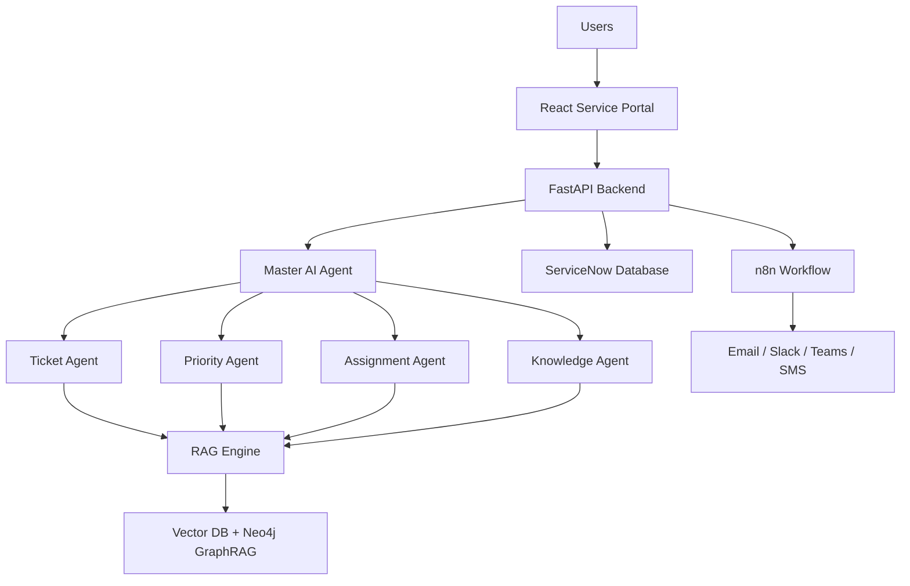

# ServiceNow Agentic AIOps Platform

Enterprise AI-powered ServiceNow platform for automated ticket triage, RAG resolutions, GraphRAG RCA, escalation, and management dashboards.

**Repository:** [sharanyashwant27-tech/ServiceNow-AIOps-Agent-Agentic-AI](https://github.com/sharanyashwant27-tech/ServiceNow-AIOps-Agent-Agentic-AI)

**Local URL:** [http://localhost:8910](http://localhost:8910)  
**Demo login:** `admin@example.com` / `admin123`

## System Architecture

```text
Users
  │
React Service Portal
  │
FastAPI Backend
  │
Master AI Agent
  ├── Ticket Agent
  ├── Priority Agent
  ├── Assignment Agent
  └── Knowledge Agent
  │
RAG Engine
  │
Vector DB + Neo4j GraphRAG
  │
ServiceNow Database
  │
n8n Workflow
  │
Email | Slack | Teams | SMS
```



Live view: **Architecture** page in the portal (`GET /api/v1/stack/architecture`).

## Technology Stack

| Component | Technology |
| --- | --- |
| Backend | Python (FastAPI) |
| Frontend | React.js |
| Database | PostgreSQL (SQLite local fallback) |
| Cache | Redis |
| Vector Database | Qdrant / Milvus / Pinecone |
| Graph Database | Neo4j |
| LLM | GPT / Llama 3 / Claude |
| Workflow | n8n |
| RAG | LangChain |
| GraphRAG | Neo4j + LangGraph |
| AI Framework | LangGraph |
| Agent Framework | CrewAI / AutoGen (facade; LangGraph default) |
| Authentication | JWT |
| OCR | Tesseract |
| Email | SMTP |
| Notifications | Slack / Teams |
| ServiceNow Integration | REST API |
| Monitoring | Prometheus + Grafana |
| Deployment | Docker + Kubernetes |

## Docker image

The API image is built from [`backend/Dockerfile`](backend/Dockerfile). It includes the React production build and ships this `README.md` at `/app/README.md` inside the container.

### Build

```bash
# from repository root
docker build -f backend/Dockerfile -t servicenow-aiops:latest .
```

Optional tag for GitHub Container Registry:

```bash
docker build -f backend/Dockerfile \
  -t ghcr.io/sharanyashwant27-tech/servicenow-aiops-agent-agentic-ai:latest .
```

### Run API only

```bash
docker run --rm -p 8910:8910 \
  -e USE_INMEMORY_FALLBACK=true \
  servicenow-aiops:latest
```

Open http://localhost:8910 and sign in with the demo credentials above.

Inspect the bundled README:

```bash
docker run --rm servicenow-aiops:latest cat /app/README.md
```

### Full stack (Docker Compose)

```bash
docker compose up --build
```

| Service | URL |
| --- | --- |
| App | http://localhost:8910 |
| Prometheus | http://localhost:9090 |
| Grafana | http://localhost:3000 (admin/admin) |
| n8n | http://localhost:5678 |
| Neo4j Browser | http://localhost:7474 |
| Qdrant | http://localhost:6333 |

Copy [`.env.example`](.env.example) to `.env` and set LLM / ServiceNow / notification secrets as needed.

## Quick start (local, without Docker)

```bash
cd backend
python -m venv .venv
# Windows: .venv\Scripts\activate
pip install -r requirements.txt

cd ../frontend
npm install
npm run build

cd ../backend
uvicorn app.main:app --host 0.0.0.0 --port 8910
```

## Key APIs

- `GET /health` / `GET /api/v1/health` — health check
- `GET /api/v1/dashboard` — ticket dashboard cards + charts
- `GET /api/v1/stack/tech` — live stack inventory
- `POST /api/v1/automation/ingest-alert` — auto-create tickets
- `POST /api/v1/stack/rag/query?q=...` — LangChain RAG
- `POST /api/v1/stack/ocr` — Tesseract OCR upload
- `POST /api/v1/stack/notify/test` — SMTP/Slack/Teams test
- `GET /metrics` — Prometheus metrics
- `POST /api/v1/automation/escalate-overdue` — SLA escalation

## SLA targets

| Priority | Target |
| --- | --- |
| P1 | 2 hours |
| P2 | 4 hours |
| P3 | 6 hours |

## Tests

```bash
cd backend
pytest -q
```

## License

MIT
